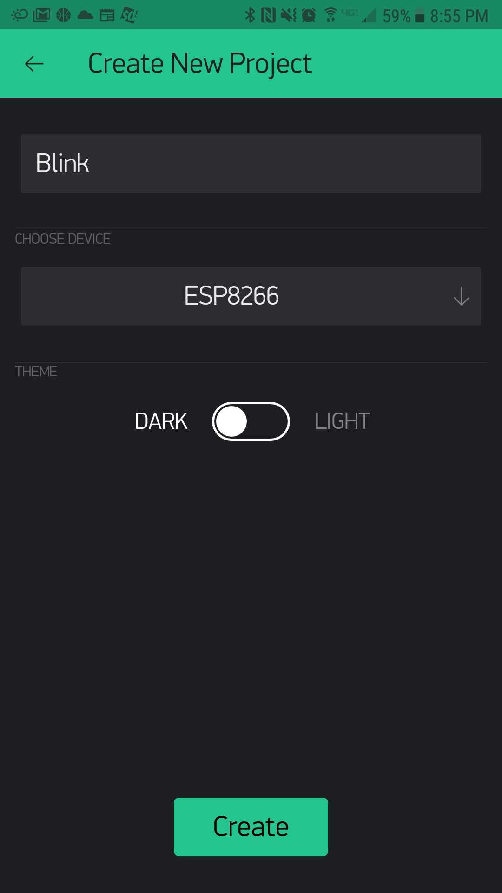

I have had an interest in home automation and the Internet of Things for a long time now, but have never made the leap. I have not been willing to make the commitment to a certain brand or technology because I didn’t want to invest a significant amount of money only to see it fade away. Home automation is still in its infancy and the market is changing very rapidly. Most products on the market only solve a small portion of what I want to do and getting multiple products to work together is difficult. I find the products to also be relatively expensive and out of my impulse buying range.

After a lot of research I found that I could build some of these products relatively cheaply if I wanted to put in the time to do so. I could also build in all the possible features I wanted instead of just what the product supported. The best place to start, I figured, was a [Hello world](https://en.wikipedia.org/wiki/%22Hello,_World!%22_program) IoT project.

## Goals for the Project

The Hello World project for hardware is the blink circuit, which is basically a circuit that blinks an LED. This needed to be a true IoT project though, so I wanted to blink the LED from my mobile device from anywhere I had internet connectivity. I also wanted to be able to build this in a night or two, which meant using as many off the shelf offerings as possible. Lastly, it needed to be inexpensive.

## Parts

- [NodeMCU LUA WiFi ESP8266 Development Board](http://amzn.to/2iYBeTo)
- [Arduino Starter Kit](http://amzn.to/2jWg3ku)
- [Blynk](http://www.blynk.cc/)

## Schematic


## Blynk App Setup

#### 1. Download

Download the Blynk app from the [Apple App Store](https://itunes.apple.com/us/app/blynk-control-arduino-raspberry/id808760481?ls=1&mt=8) or the [Google Play store](https://play.google.com/store/apps/details?id=cc.blynk).

#### 2. Create a Blynk Account

The Blynk app does have in app purchases but it will be free for what we need.

#### 3. Create a New Project, Give it a Name, and Choose Your Hardware



Type in Blink for the name of the project and select the ESP8266 for your device.


#### 5. Add Widgets

Tap in your project and add a Button. Tap on the Button to get into the Button Settings. Once there, click on the PIN and select Digital and gp5.


#### 4. Auth Token

Check the email address that you used when creating your account. There should be an email that contains your Auth Token. You will need this when programing your board.

## Programing the Board

#### 1. Download

Download the [Adruino IDE](https://www.arduino.cc/en/main/software)

#### 2. Install the Board

Next, you will need to install the ESP8266 board. To do this go to File > Preferences then, towards the bottom of the window, copy this URL into the “Additional Board Manager URLs” text box: http://arduino.esp8266.com/stable/package_esp8266com_index.json.
Now you need to install the board, go to Tools > Boards > Boards Manager then in the search box type ESP8266. Then click Install on the esp8266 by ESP8266 Community board.


#### 3. Install the Blynk Library

Go to Sketch > Include Library > Manage Libraries then in the search box type Blynk. Then click Install on the Blynk library.


#### 4. Select a Board

To select a board go to Tools > Board: > NodeMCU 1.0 (ESP-12E Module).


#### 5. The Code

Copy and paste the code below and make sure to set “YourBlynkAuthToken” to the Blynk Auth Token you received in an earlier step. Also set your wifi network name and password in “YourNetworkName” and “YourNetworkPassword”.

```c
    #define BLYNK_PRINT Serial
    #include <ESP8266WiFi.h>
    #include <BlynkSimpleEsp8266.h>

    // You should get Auth Token in the Blynk App.
    // Go to the Project Settings (nut icon).
    char auth[] = "YourBlynkAuthToken";

    // Your WiFi credentials.
    // Set password to "" for open networks.
    char ssid[] = "YourNetworkName";
    char password[] = "YourNetworkPassword";

    void setup()
    {
        Serial.begin(115200);
        Blynk.begin(auth, ssid, password);
    }

    void loop()
    {
        Blynk.run();
    }
```

#### 6. Upload

Plug in the micro-usb into your NodeMCU board and connect it to your computer. Select the Port that the usb is plugged into (Note: There might be multiple Ports available to pick from, just select one and if it doesn’t work try another one) by going to Tools > Port > COMxx. Lastly hit the right arrow button at the top of Arduino IDE or Sketch > Upload. It will take a few minutes to upload. Once completed, open the Blynk app and press the button to watch the light turn on!
