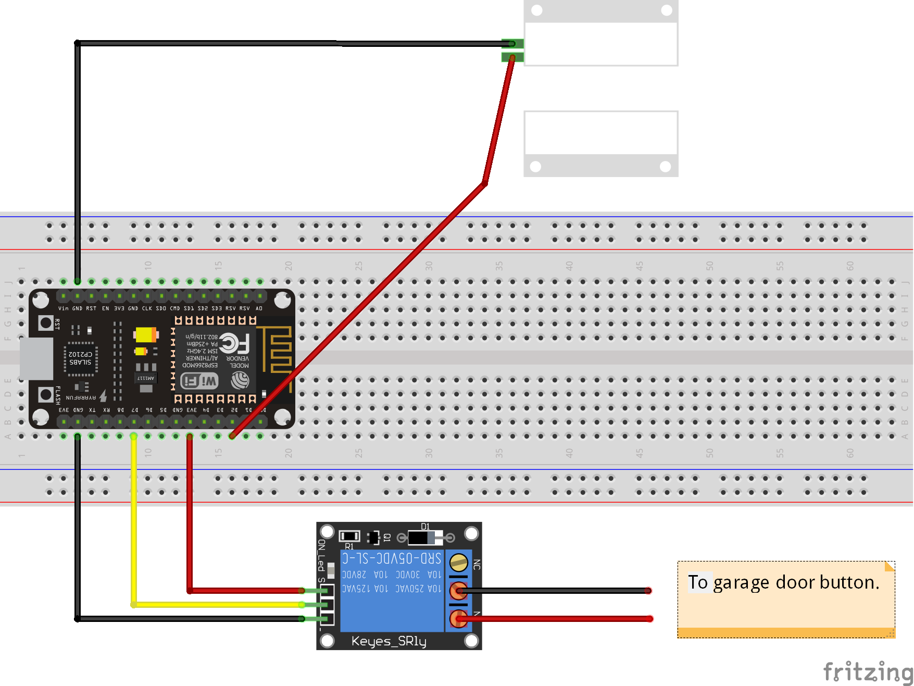
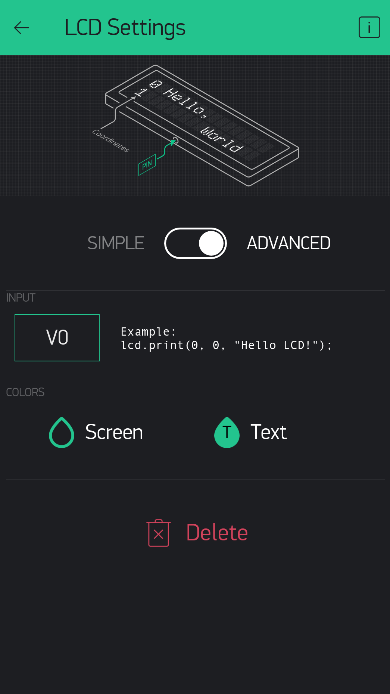
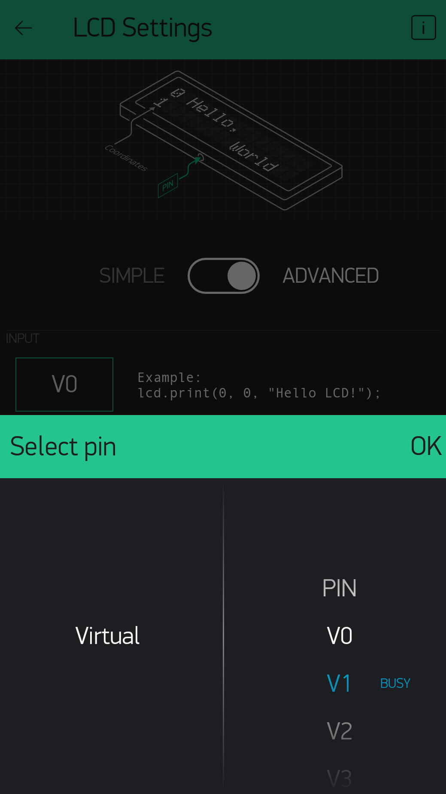
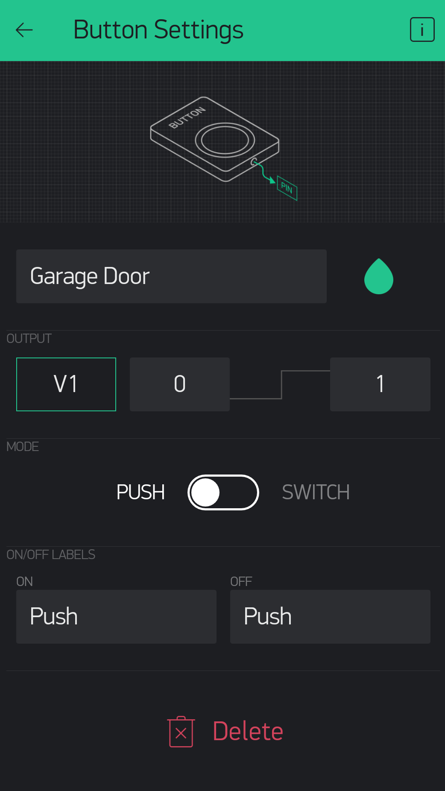
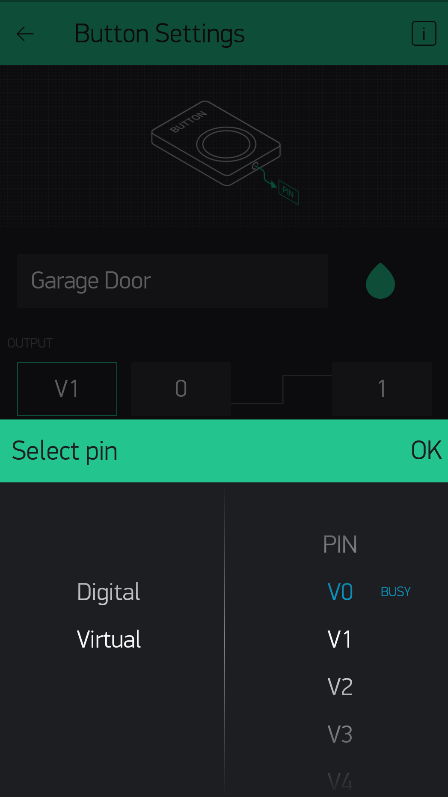
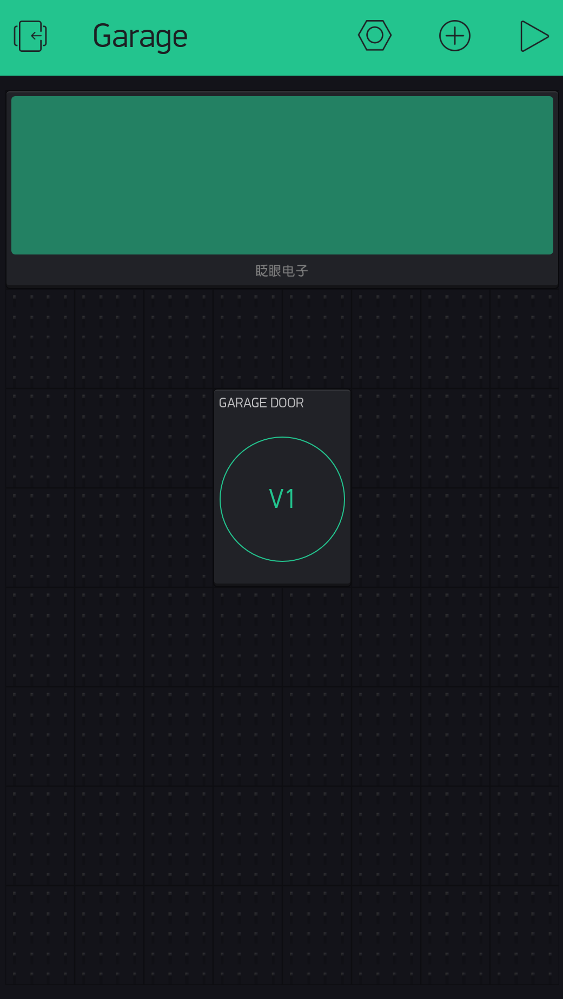
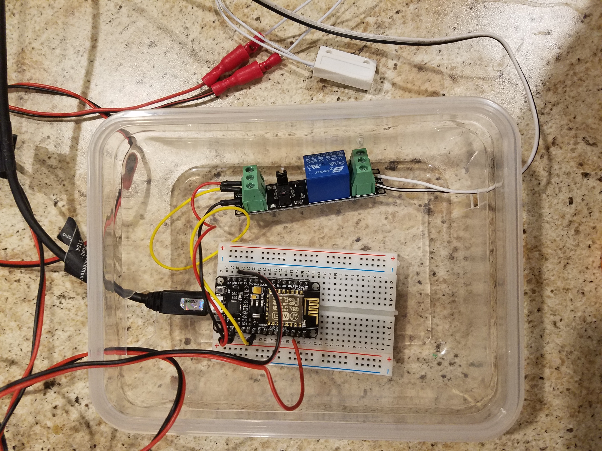
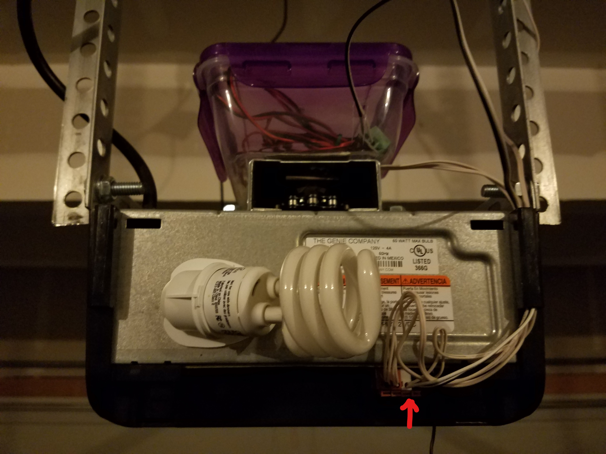
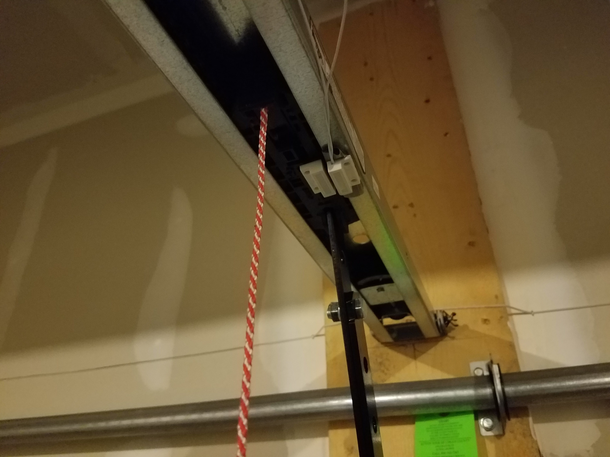

In my first post [Getting Started With IoT](/Getting-Started-With-IoT/), I showed how you can make your first Internet of Things circuit and control a LED over the internet. While I still think that is pretty awesome, it is not really home automation. It does lay the groundwork for my very first home automation project and I highly recommend using that as a starting point if you want to build this project as I will not cover the basics that I already have in that post.

## Goals for the Project

 I can’t tell you how many times I have made it into bed and then thought to myself “Did I close the garage door.” Then I get up and walk all the way downstairs, only to find out that I already closed it. Then there are those times I leave the house in a fog in the morning, as I'm not a morning person, and can’t remember if I put the door down as I was driving away. Since these things happen to me on a weekly, sometimes daily basis I figured this would be a great first project to tackle. So for my first home automation project, I wanted to be able to control my garage door from my phone. Not only did I want to be able to open and close it, I also wanted to be able to determine if it was currently opened or closed. I researched some commercial offers on the market, but this seemed simple enough that I could build it at a fraction of the cost of those products.

 ## Parts

- [NodeMCU LUA WiFi ESP8266 Development Board](http://amzn.to/2D3vwGt)
- [Arduino Starter Kit](http://amzn.to/2Fe76La)
- [3.3v Relay](https://www.ebay.com/itm/DC-3V-3-3V-Relay-High-Level-Driver-Module-optocouple-Relay-Module-for-Arduino/331502222842?rt=nc&_soffid=5&_soffType=PromotionalShipping&_trksid=p5731.m3795&siteId=0&pguid=e5179e4815f0aa1307b2ca1cffcc34bb&AdChoicePreference=true&rmvSB=true)
- [Door Sensor Magnetic Reed Switch](http://amzn.to/2FeWz2f)
- Wire - I used some 22awg speaker wire that I already had, however, using stranded wire in a breadboard can be difficult. I would recommend solid core if you don't plan on doing any soldering.
- Butt Connectors - I used these to join wires, you can use whatever you like.
- [Power Supply](http://amzn.to/2CLPCHN) - I used an old micro usb and power brick I had but if you need to purchase one something like this will work fine.
- [Blynk](http://www.blynk.cc/)

## Schematic



## Blynk App Setup

#### 1. Create a New Project and Add a LCD Widget

Add a LCD widget and set it to use Virtual Pin V0.



#### 2. Add a Button Widget

Add a Button Widget and set it to use Virtual Pin V1.



#### 3. Your Garage Project

You should end up with something that looks like this.



#### 4. Auth Token

Check the email address that you used when creating your account. There should be an email that contains your Auth Token. You will need this when programing your board.

## Programing the Board

#### 1. The Code

Copy and paste the code below and make sure to set “YourBlynkAuthToken” to the Blynk Auth Token you received in an earlier step. Also set your wifi network name and password in “YourNetworkName” and “YourNetworkPassword”.

```c
#define BLYNK_PRINT Serial
#include <ESP8266WiFi.h>
#include <BlynkSimpleEsp8266.h>

// You should get Auth Token in the Blynk App.
// Go to the Project Settings (nut icon).
char auth[] = "YourBlynkAuthToken";

// Your WiFi credentials.
// Set password to "" for open networks.
char ssid[] = "YourNetworkName";
char pass[] = "YourNetworkPassword";

const int MAGNETIC_SENSOR_PIN = 4;
const int RELAY_PIN = 13;

WidgetLCD lcd(V0);

bool currentDoorPosition = 1;
bool previousDoorPosition = 0;

void setup()
{
  Serial.begin(115200);
  Blynk.begin(auth, ssid, pass);
  while (Blynk.connect() == false) {
    // Wait until connected
  }
  pinMode(MAGNETIC_SENSOR_PIN, INPUT_PULLUP);
  pinMode(RELAY_PIN, OUTPUT);
}

void loop()
{
  Blynk.run();
  garageDoorMagneticSensor();
}

BLYNK_WRITE(V1)
{
  //--on Blynk button press, activate garage door for .6 second
  digitalWrite(RELAY_PIN, HIGH);
  delay(600);
  digitalWrite(RELAY_PIN, LOW);
}

void garageDoorMagneticSensor()
{
  currentDoorPosition = digitalRead(MAGNETIC_SENSOR_PIN);
  if (currentDoorPosition != previousDoorPosition) {
    previousDoorPosition = currentDoorPosition;
    if (currentDoorPosition == LOW)
    {
      lcd.clear();
      lcd.print(1, 0, "CLOSED");
    }
    else
    {
      lcd.clear();
      lcd.print(1, 0, "OPEN");
    }
  }
}
```

Notice on V1 write, which we set up to be the button in the Blynk app, will turn on the relay for .6 seconds which mimics pressing the button on your garage door. Also notice that we hold the state of the door in memory and only send it to the Blynk LCD if it has changed, that way we don't continue to send the same state to Blynk over and over in the loop.

## Install

Here is my assembled board. I put my electronics in tupperware for now and cut holes in the sides to run the wires.



On the rear of my garage door opener, I located the inputs where the garage door button connected and pushed the wires that come out of the relay.



With the door closed I added the magnetic sensor to the lift arm of the garage door and ran the wires above the arm.



## Conclusion

I have lots of ideas on how I can make this project even better and I plan to continue to add features to it. As I do I will post each incremental feature which will build on the last. While Blynk is providing a nice interface for now, it may not be the perfection solution in the end.